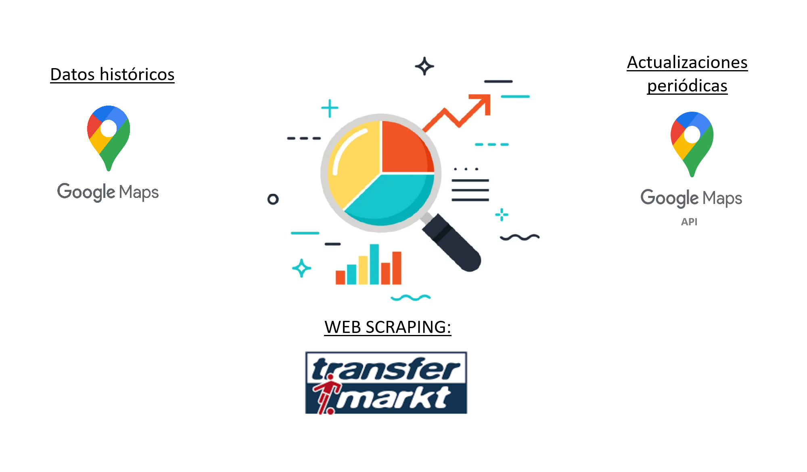
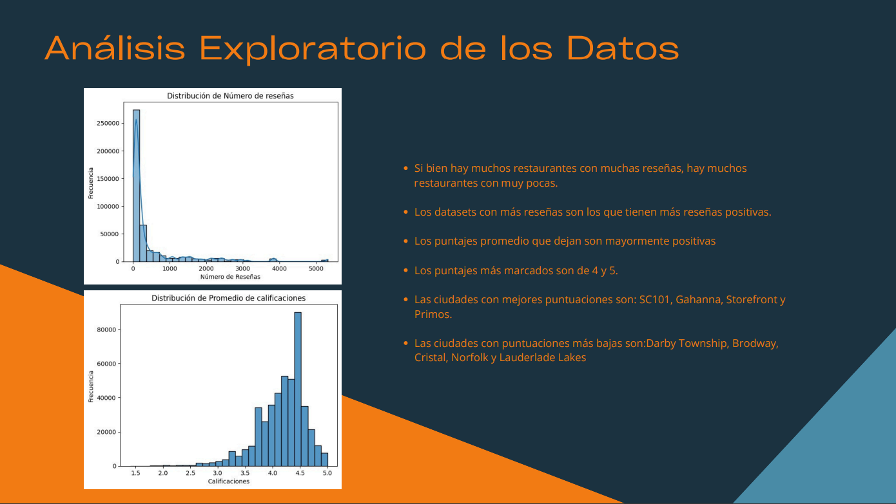
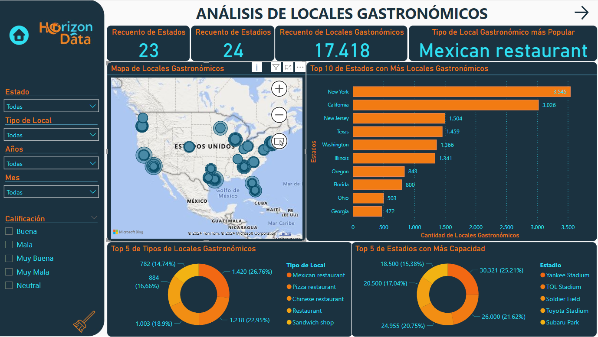
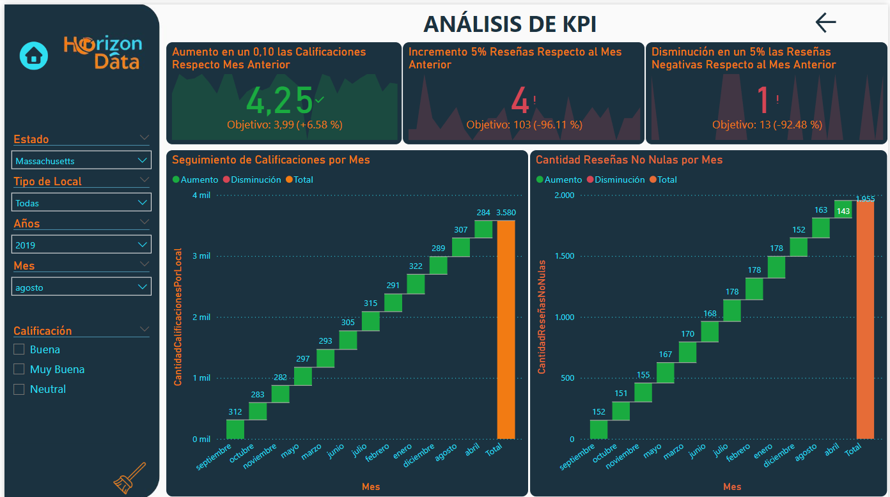
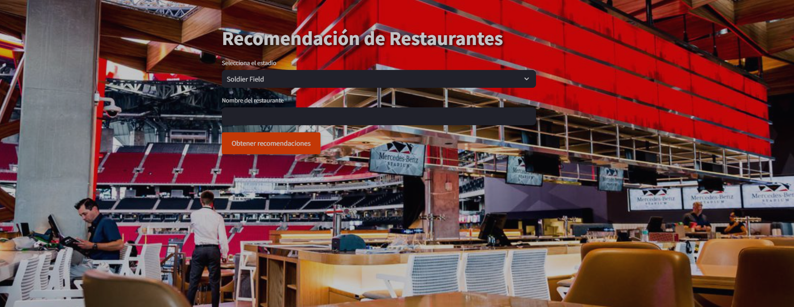
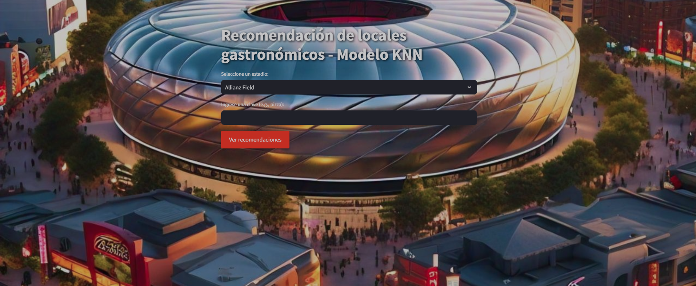
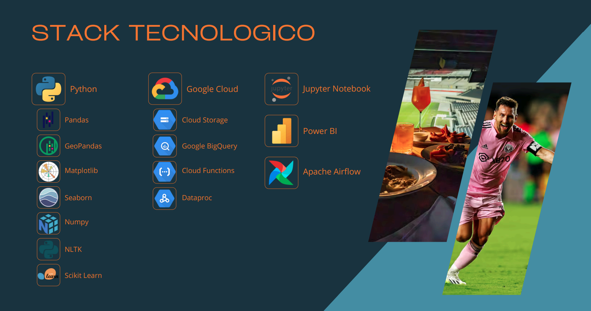
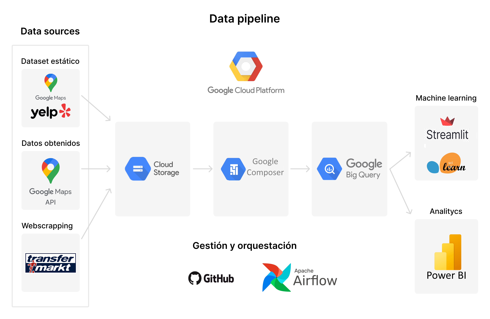
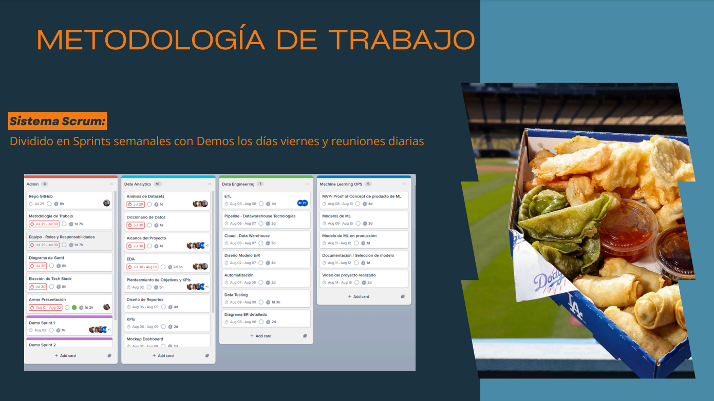
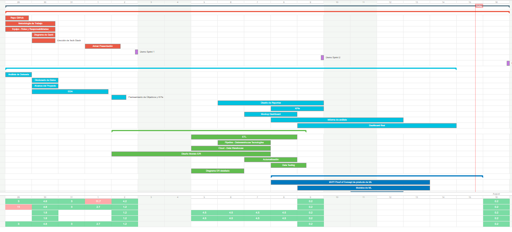

***
# 
Horizon Data: Análisis de Reseñas de Locales Gastronómicos Cercanos a Estadios de la MLS

 - Link a Youtube:

  

## Índice

  
Tabla de contenido

  1. [Índice](#índice)
  2. [Sobre el proyecto](#sobre-el-proyecto)
  3. [Guía paso a paso](#guía-paso-a-paso)
  4. [KPI](#kpi)
  5. [Tecnologías Seleccionadas](#tecnologías-seleccionadas)
  6. [PipeLine](#pipeline)
  7. [Cronología](#cronología)
  8. [Miembros del Equipo](#miembros-del-equipo)

## Sobre el proyecto

**Objetivo**
 El objetivo es brindar a una compañía administradora de estadios de la Major League Soccer (MLS) la información necesaria para definir la concesión de sus locales gastronómicos y monitorear la calidad del servicio.

## Alcance 

## Guía Paso a Paso

*__Paso 1: ETL (Extracción, Transformación y Carga)__*

*__Paso 2: Análisis Exploratorio de Datos (EDA)__*

*__Paso 3: Dashboard__*

Descripción General

Este tablero de Power BI ha sido diseñado para proporcionar una visión completa y detallada sobre los locales gastronómicos ubicados cerca de los estadios de la MLS en Estados Unidos. A través de este análisis, los usuarios pueden explorar la distribución geográfica de los locales, identificar los tipos de locales más populares y realizar comparaciones entre diferentes estados y estadios. Además, se ofrece una evaluación exhaustiva de las calificaciones y reseñas realizadas por los clientes, permitiendo un seguimiento de las tendencias a lo largo del tiempo. El objetivo principal es facilitar la toma de decisiones estratégicas para mejorar la experiencia gastronómica en los estadios y optimizar la oferta disponible.
dashboard:

1-Análisis

2-Análisis

3-Análisis

*__Paso 4: Modelo de Recomendación__*

Los sistemas que hemos implementado brindan una funcionalidad avanzada para la recomendación de restaurantes, basándose en técnicas como la similitud coseno y el modelo de vecinos más cercanos. Este desarrollo ejemplifica cómo la combinación de herramientas diversas y metodologías especializadas, como Streamlit, BigQuery y Machine Learning, pueden integrarse de manera efectiva para crear una aplicación web interactiva, intuitiva y altamente útil. A través de esta solución, demostramos cómo la tecnología puede transformar datos complejos en recomendaciones precisas y valiosas, mejorando tanto la experiencia del usuario final como la toma de decisiones estratégicas.

  - Modelo de Recomendación:
    
Este modelo de recomendación está diseñado para ayudarte a encontrar los locales gastronómicos más similares a uno de tu interés, según el estadio que elijas. Solo necesitas seleccionar un estadio y el nombre de un local gastronómico, y el sistema te devolverá una lista de locales similares para que puedas explorar nuevas opciones.

  - Modelo KNN:

El modelo KNN (K-Nearest Neighbors) ofrece recomendaciones basadas en la categoría y el estadio que selecciones. Al ingresar el estadio y la categoría de tu interés, el modelo te devolverá el lugar con las mejores calificaciones y más recomendado en esa zona. Además, proporciona la URL de Google Maps para facilitar la ubicación y el acceso al lugar.

## KPI
Los indicadores clave de rendimiento nos ayudarán a enfocarnos en objetivos claros y medibles para impulsar el éxito de nuestros establecimientos.

__1.  Crecimiento del nivel de satisfacción__

  - *KPI:* Incrementar en un decimal (+0,10) la calificación promedio de Google Maps
  - *Definición:* Crecimiento del nivel de satisfacción de los clientes respecto del mes anterior para el conjunto de locales gastronómicos en los estadios.
  - *Objetivo:* +0,10

__2. Aumentar las reseñas__

  - *KPI:* Aumentar en un 5% mensual la cantidad de reseñas
  - *Definición:*  Expansión del volumen de interacciones total respecto del mes anterior.
  - *Objetivo:* +5%

__3. Disminuir reseñas negativas (calificación 1 o 2)__

  - *KPI:* Disminuir en un 5% el porcentaje de reseñas negativas (calificación 1 o 2)
  - *Definición:* Mejoramiento del nivel de satisfacción de los clientes respecto al mes anterior logrando una caía en las reseñas negativas.
  - *Objetivo:* -5%

## Tecnologías Seleccionadas

## PipeLine
El pipeline de datos, ilustrado en el siguiente diagrama, describe el flujo de datos desde su ingesta inicial hasta su análisis y modelado final. Este pipeline está diseñado para ser escalable, eficiente y automatizado, asegurando la integridad y disponibilidad de los datos en cada etapa del proceso. 

## Cronología
A lo largo del proyecto utilizamos la metodología Scrum

## Estructuramos nuestro Gantt en cuatro áreas clave:

  - __Administración:__ Encargado de la gestión general y la coordinación de todos los departamentos. 
  - __Data Analytics:__ Responsable de analizar los datos de las reseñas y la satisfacción del cliente para proporcionar insights accionables. 
  - __Data Engineering:__ Se ocupa de la infraestructura y las herramientas necesarias para recopilar y procesar los datos de manera eficiente. 
  - __Machine Learning OPS:__ Enfocado en desarrollar modelos predictivos que nos ayuden a anticipar tendencias y mejorar la toma de decisiones. 

## Miembros del Equipo

 - Eugenia Memolli 
 - Guillermo Gerbaldo 
 - Jessica Sandagorda 
 - Pablo Clementi 
 - Renato Giovanetti 

## Agradecimientos.

Queremos expresar nuestro más sincero agradecimiento a todos los que han sido parte de este increíble viaje de aprendizaje. A nuestros compañeros, quienes han sido una fuente constante de motivación y apoyo; a los profesores, por su dedicación y paciencia al compartir su conocimiento; y a los TA’s, por estar siempre dispuestos a ayudarnos y guiarnos en cada paso del camino. También agradecemos de corazón a toda la comunidad de Henry, por crear un ambiente en el que el aprendizaje y el crecimiento personal se encuentran en el centro de todo.

¡Gracias a todos por hacer de esta experiencia algo inolvidable!

